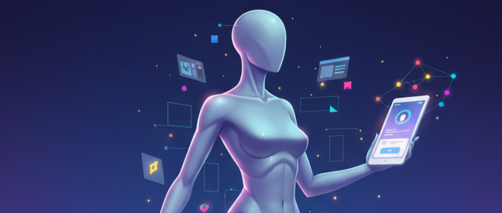

  
  
  <h1 align="center">👋 Merhaba, ben Hüseyin!</h1>
  <h3 align="center">Sizin için modern ve zarif tasarımlar oluşturan bir UI/UX ve Grafik Tasarımcıyım.</h3>

  
  
  
  

---

### 👨‍💻 Kısaca Ben ve İşim

> Karşılaştığınız sorunlar karşısında hızlı, basit ve estetik çözümler üretiyorum. Ayrıca tüm sorunların kullanıcı dostu olduğundan emin oluyorum. İşinize en az sizin kadar değer veriyor, hak ettiği özeni gösteriyorum.

 

* 🎨 **UI/UX Tasarımcısı** olarak kullanıcı deneyimini (UX) ön planda tutan, estetik ve işlevsel kullanıcı arayüzleri (UI) tasarlıyorum.
* 🖌️ **Grafik Tasarımcı** olarak marka kimliği, illüstrasyon ve pazarlama materyalleri konularında çözümler üretiyorum.
* 💡 Şu anda **Yeni dil öğrenmeye** odaklanıyorum.
* 📬 Bana nasıl ulaşırsınız: **......**

---

### 🛠️ Yetenekler & Kullandığım Araçlar

Burada en çok kullandığınız araçları ve yeteneklerinizi sergileyebilirsiniz.

#### UI/UX Tasarım

#### Grafik Tasarım

---

### 📊 GitHub İstatistiklerim

  
   
  

